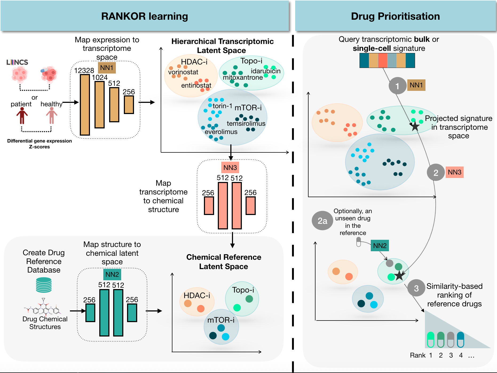

# RANKOR: Direct Drug Prioritization from Bulk and Single-Cell Transcriptomic Signatures
 

\section*{Overview}

RANKOR is a machine learning framework for \textbf{direct drug prioritization from bulk and single-cell transcriptomic signatures}. 
Unlike traditional enrichment or signature-matching approaches, RANKOR learns structured representations of gene expression and chemical space to enable efficient and scalable ranking of candidate compounds.

The framework constructs two aligned latent spaces: a \textbf{transcriptomic latent space} capturing biological mechanisms of action, and a \textbf{chemical latent space} representing drug structures. 
A cross-modal mapping connects both spaces, allowing transcriptomic signatures to be projected into chemical space, where drugs are ranked based on similarity.

RANKOR achieves performance \textbf{comparable to GSEA}, while demonstrating strong generalization to unseen compounds and cellular contexts, as well as substantially reduced computational runtime. 
Additionally, the model provides biologically meaningful gene-level attributions, supporting interpretability of drug prioritization results.

\section*{Key Contributions}

\begin{itemize}
    \item \textbf{Direct drug prioritization:} Formulates drug ranking as the primary task, avoiding indirect inference via enrichment or similarity matching.
    
    \item \textbf{Cross-modal representation learning:} Aligns transcriptomic and chemical latent spaces to connect gene expression signatures with candidate drugs.
    
    \item \textbf{Generalization to unseen compounds:} Enables prioritization of drugs without prior transcriptomic profiling using chemical structure embeddings.
    
    \item \textbf{Scalability and efficiency:} Achieves orders-of-magnitude faster inference compared to enrichment-based methods such as GSEA.
    
    \item \textbf{Robustness to noise:} Maintains stable performance under moderate perturbations in gene expression data.
    
    \item \textbf{Applicability to single-cell data:} Supports drug prioritization at the level of patient-specific cell states and subpopulations.
    
    \item \textbf{Interpretability:} Provides gene-level attribution analyses that highlight biologically meaningful transcriptional programs driving predictions.
\end{itemize}
